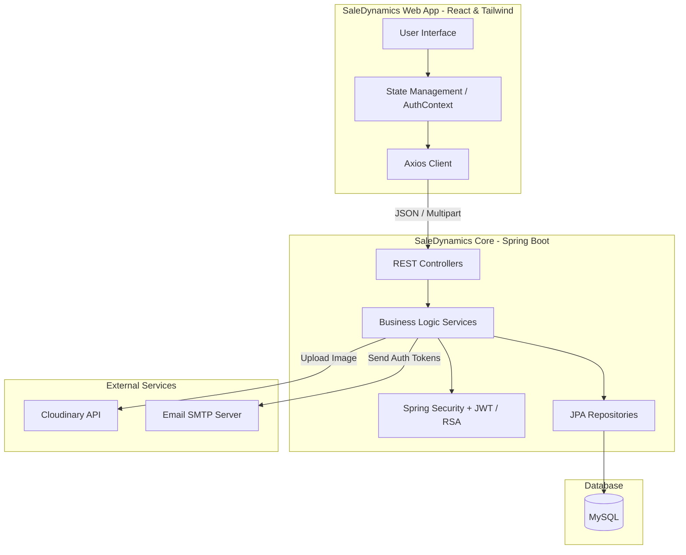
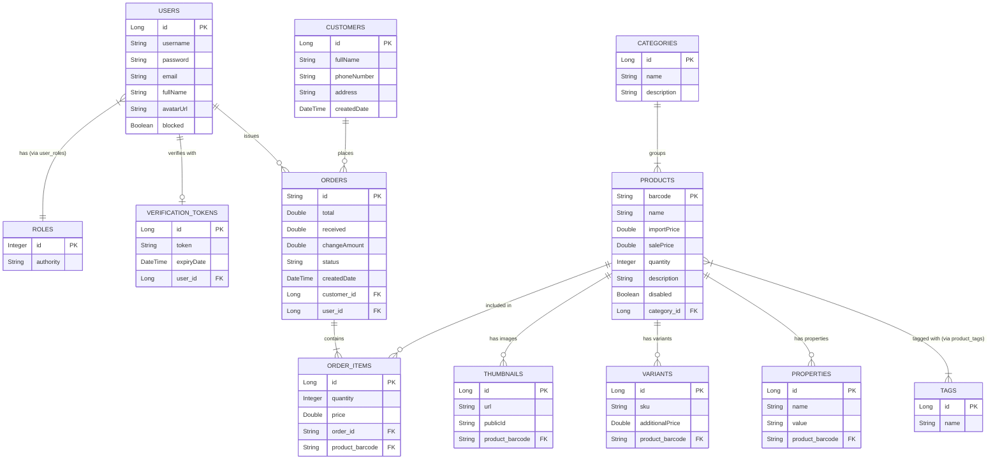

# SaleDynamics - Enterprise Point of Sale (POS) System

[](https://spring.io/projects/spring-boot)
[](https://reactjs.org/)
[](https://tailwindcss.com/)
[](https://opensource.org/licenses/MIT)

SaleDynamics is a high-performance, responsive Point of Sale (POS) and inventory management system designed for modern retail environments (such as electronics and mobile accessories). The platform emphasizes seamless mobile-desktop user experiences and a secure, containerized backend architecture.

---

## Product Overview

*Placeholder for Showcase Product GIF / Video Demonstration*

---

## Key Business Values & Solved Problems

SaleDynamics is designed to address key operational challenges in retail management:

*   **Omnichannel POS Terminal:** A fluid checkout interface optimized for both desktop monitors and one-handed mobile use. The interface features a thumb-zone optimized layout using a persistent Bottom Navigation bar.
*   **Real-time Analytics Dashboard:** Monitors revenue trends, order volumes, and top-performing products with responsive, interactive charting.
*   **Secure Staff Management:** Role-based access control (RBAC) with account suspension workflows, asymmetric token-based authentication (RSA keys), and secure email-based staff onboarding.
*   **Optimized Cloud Storage:** Direct integration with Cloudinary for scalable, CDN-backed product image hosting and management.

---

## System Architecture

The application implements a decoupled client-server architecture to ensure high scalability, separation of concerns, and ease of deployment.



---

## Database Schema (Core ERD)

The database schema is fully normalized to guarantee transactional integrity and eliminate data redundancy.



---

## Technical Challenges & Engineering Solutions

### 1. Mobile-First POS Interface & Viewport Constraints
Point of Sale interfaces are traditionally data-heavy and struggle to adapt to mobile dimensions. To resolve this:
*   Developed responsive, stackable container layouts that replace fixed viewport constraints.
*   Enforced bottom navigation bars and thumb-zone optimization to streamline mobile-specific checkouts.
*   Prevented height clipping and page-scrolling conflicts across different screen dimensions using dynamic height variables (`min-h-screen` vs `h-screen`).

### 2. High-Contrast Accessible Dark Mode
Ensured readability and accessibility under various lighting environments (especially in dark warehouse or counter setups) by:
*   Establishing a strict Tailwind-based neutral color palette (mapping base background elements to `bg-neutral-900`/`bg-neutral-950`).
*   Defining high-contrast typographic styles (primary text mapped to `text-neutral-200`/`text-white`) to maintain clean text contrast that meets WCAG accessibility guidelines.

### 3. Asymmetric Cryptography & Secure Staff Onboarding
To transition away from weak default credentials and secure the platform's distributed nodes:
*   Implemented asymmetric **RSA Key Pairs** (using Spring Boot's custom key configuration) to sign and verify JSON Web Tokens (JWT) rather than standard symmetric secrets.
*   Enforced secure email-based verification via SMTP (configured with Mailtrap for sandbox testing) when onboarding new staff. Accounts remain locked until the verification token is verified.

---

## Tech Stack

### Frontend
*   **Core Library:** React 18 (built using Vite)
*   **Routing & State Management:** React Router DOM, Context API with Custom Reducers
*   **UI & Component Design:** Tailwind CSS, Headless UI, Framer Motion
*   **Data Visualization:** Recharts
*   **Form Management:** React Hook Form with Zod schema validation

### Backend
*   **Core Framework:** Java 17, Spring Boot 3
*   **Security Architecture:** Spring Security 6, OAuth2 Resource Server (JWT signed with asymmetric RSA Key Pairs)
*   **Persistence & Database Access:** Spring Data JPA, Hibernate ORM
*   **Media Hosting:** Cloudinary Java SDK Integration
*   **Communications:** JavaMailSender (SMTP) for verification and system alerts

---

## Getting Started (Local Development)

### Prerequisites
*   Node.js (v18 or higher)
*   Podman or Docker with Compose support
*   Cloudinary developer account
*   Mailtrap developer account (or any other SMTP provider)

### 1. Environment Configuration

#### Backend Configuration
Create or configure the `.env` file located in the `/be` directory with the following variables:

```ini
# Cloudinary Keys
CLOUDINARY_CLOUD_NAME=your_cloud_name
CLOUDINARY_API_KEY=your_api_key
CLOUDINARY_API_SECRET=your_api_secret

# Mailtrap / SMTP Settings
MAIL_HOST=sandbox.smtp.mailtrap.io
MAIL_PORT=2525
MAIL_USERNAME=your_mailtrap_username
MAIL_PASSWORD=your_mailtrap_password
```

#### Frontend Configuration
Verify or configure the `.env` file in the `/fe` directory to point to the backend API:

```ini
VITE_API_BASE_URL=http://localhost:8080/
```

### 2. Launching Services

#### Backend (Database, Redis, and Spring Boot)
The project includes a `rebuild.sh` script to clean previous runs, build the backend, and spin up database, cache, and application containers.

1. Grant execute permissions to the script:
   ```bash
   chmod +x rebuild.sh
   ```
2. Run the script:
   ```bash
   ./rebuild.sh
   ```
3. Once completed, verify the status:
   *   **Database:** `localhost:3306` (MySQL)
   *   **Redis:** `localhost:6379`
   *   **Backend REST API:** `http://localhost:8080`

#### Frontend (Vite Server)
1. Navigate to the frontend directory:
   ```bash
   cd fe
   ```
2. Install dependency packages:
   ```bash
   npm install
   ```
3. Run the development server:
   ```bash
   npm run dev
   ```
4. Access the web interface at `http://localhost:3000`.

---

## Testing & Credentials

For local validation and sandbox review, use the default administrator credentials:
*   **Username:** `admin`
*   **Password:** `admin`

*Note: You will be prompted to update this password immediately upon your first login.*

---

## Authors & Contributions

*   **Lê Phú Hào**
    *   [GitHub Profile](https://github.com/LPH1110)
    *   [LinkedIn Profile](https://www.linkedin.com/in/phuhaole/)